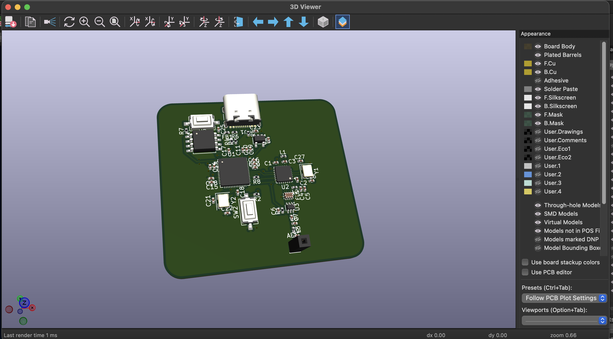
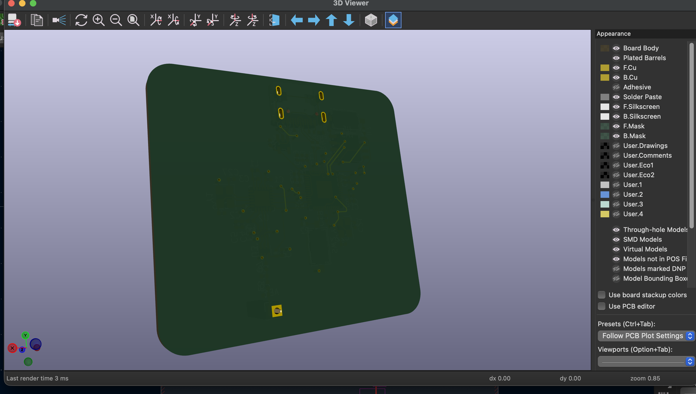
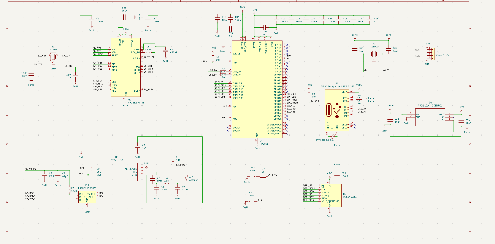
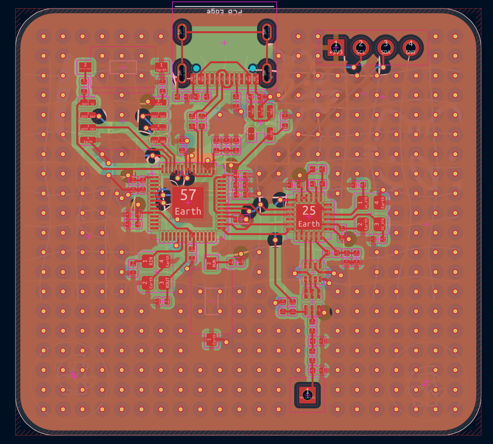

# Lora

A LoRa board project that I made in order to figure out how radios really work, rather than just reading about them. It was a great way for me to do some PCB design and play around with KiCad, while learning what to do when things don’t go according to plan (which happened quite a bit).

# How its works

This board is a custom designed wireless communication module for long range applications. It is based on the dual-core Raspberry Pi RP2040 microcontroller and SX1262 LoRa transceiver.

- Power & Connectivity. 5V power and data thru USB-C port. An AP2112K-3.3 LDO regulator efficiently steps this down to a stable 3.3V for the system.

- Processing & Memory - The RP2040 is the brain. The RP2040 requires external memory, so it’s coupled with a W25Q16JV SPI Flash chip to store your firmware.

- Long-Range RF The SX1262 provides sub-GHz LoRa wireless communication. The RF path is controlled by a PE4259 RF switch and a Johanson Balun to condition the signal for the antenna.

- Internal Routing: The RP2040 uses its SPI busses to talk to the Flash memory and the SX1262 LoRa chip.

[ USB-C ] ──5V──► [ AP2112K-3.3 LDO ] ──3.3V──┐
                                              ▼
[ W25Q16 Flash ] ◄──SPI── [ RP2040 ] ──SPI──► [ SX1262 LoRa ]
                        (Main Brain)                │
                                                    ▼
                                            [ PE4259 Switch ]
                                                    │
                                                    ▼
                                                [ Antenna ]
                                                    📡

                                            

# Images:

## 3d

## Schematic

## PCB 

## Components

Total Physical Components: 51
Capacitors: 25
Resistors: 7
Inductors: 3
Crystals/Oscillators: 2
Push Buttons (Cherry MX): 2
Ferrite Beads: 1
RF Baluns: 1
USB-C Connectors: 1
Antenna/Pin Headers: 1
Voltage Regulators (AP2112K): 1
RF Switches (PE4259): 1
Flash Memory (W25Q16JV): 1
SX1262 LoRa IC: 1
RP2040 Microcontroller: 1

# Bill of Materials (BOM)

| Qty | Component | Selected Part | Supplier | Link |
|:---:|------------|---------------|----------|------|
| 1 | LoRa Spring Antenna | BW915SNX17-5W2 (915MHz) | LCSC | [lcsc.com/product-detail/C496556.html](https://www.lcsc.com/product-detail/C496556.html) |
| 1 | Antenna Pin | 2.54mm Vertical Pin Header | LCSC | [lcsc.com/product-detail/C2337.html](https://www.lcsc.com/product-detail/C2337.html) |
| 11 | 100nF Capacitor | 100nF 16V 0402 Ceramic | LCSC | [lcsc.com/product-detail/C1525.html](https://www.lcsc.com/product-detail/C1525.html) |
| 1 | 470nF Capacitor | 470nF 10V 0402 Ceramic | LCSC | [lcsc.com/product-detail/C1527.html](https://www.lcsc.com/product-detail/C1527.html) |
| 1 | 47pF Capacitor | 47pF 50V 0402 Ceramic | LCSC | [lcsc.com/product-detail/C1554.html](https://www.lcsc.com/product-detail/C1554.html) |
| 1 | 47nF Capacitor | 47nF 16V 0402 Ceramic | LCSC | [lcsc.com/product-detail/C1530.html](https://www.lcsc.com/product-detail/C1530.html) |
| 1 | 1nF Capacitor | 1nF 50V 0402 Ceramic | LCSC | [lcsc.com/product-detail/C1523.html](https://www.lcsc.com/product-detail/C1523.html) |
| 1 | 39pF Capacitor | 39pF 50V 0402 Ceramic | LCSC | [lcsc.com/product-detail/C1553.html](https://www.lcsc.com/product-detail/C1553.html) |
| 2 | 3.3pF Capacitor | 3.3pF 50V 0402 Ceramic | LCSC | [lcsc.com/product-detail/C1548.html](https://www.lcsc.com/product-detail/C1548.html) |
| 1 | Capacitor (Placeholder) | 100nF 16V 0402 Ceramic | LCSC | [lcsc.com/product-detail/C1525.html](https://www.lcsc.com/product-detail/C1525.html) |
| 2 | 1uF Capacitor | 1uF 10V 0402 Ceramic | LCSC | [lcsc.com/product-detail/C1526.html](https://www.lcsc.com/product-detail/C1526.html) |
| 2 | 15pF Capacitor | 15pF 50V 0402 Ceramic | LCSC | [lcsc.com/product-detail/C1550.html](https://www.lcsc.com/product-detail/C1550.html) |
| 2 | 10uF Capacitor | 10uF 6.3V 0402 Ceramic | LCSC | [lcsc.com/product-detail/C1528.html](https://www.lcsc.com/product-detail/C1528.html) |
| 1 | Ferrite Bead | 100 Ohm 0402 Ferrite Bead | LCSC | [lcsc.com/product-detail/C1015.html](https://www.lcsc.com/product-detail/C1015.html) |
| 1 | RF Balun | Johanson 0900FM15K0039 | LCSC | [lcsc.com/product-detail/C186411.html](https://www.lcsc.com/product-detail/C186411.html) |
| 1 | USB Type-C Connector | GCT USB4105 / 16-Pin Horizontal | LCSC | [lcsc.com/product-detail/C2765186.html](https://www.lcsc.com/product-detail/C2765186.html) |
| 1 | 15uH Inductor | 15uH 0402 SMD Inductor | LCSC | [lcsc.com/product-detail/C23985.html](https://www.lcsc.com/product-detail/C23985.html) |
| 1 | 47nH Inductor | 47nH 0402 SMD Inductor | LCSC | [lcsc.com/product-detail/C23987.html](https://www.lcsc.com/product-detail/C23987.html) |
| 1 | 9.1nH Inductor | 9.1nH 0402 SMD Inductor | LCSC | [lcsc.com/product-detail/C23988.html](https://www.lcsc.com/product-detail/C23988.html) |
| 1 | 100 Ohm Resistor | 100Ω 1% 0402 Resistor | LCSC | [lcsc.com/product-detail/C25076.html](https://www.lcsc.com/product-detail/C25076.html) |
| 1 | 10k Ohm Resistor | 10kΩ 1% 0402 Resistor | LCSC | [lcsc.com/product-detail/C25744.html](https://www.lcsc.com/product-detail/C25744.html) |
| 1 | 27.4 Ohm Resistor | 27.4Ω 1% 0402 Resistor | LCSC | [lcsc.com/product-detail/C25082.html](https://www.lcsc.com/product-detail/C25082.html) |
| 1 | 24.4 Ohm Resistor | 24.3Ω 1% 0402 (Closest value) | LCSC | [lcsc.com/product-detail/C25081.html](https://www.lcsc.com/product-detail/C25081.html) |
| 2 | 5.1k Ohm Resistor | 5.1kΩ 1% 0402 Resistor | LCSC | [lcsc.com/product-detail/C25905.html](https://www.lcsc.com/product-detail/C25905.html) |
| 1 | 1k Ohm Resistor | 1kΩ 1% 0402 Resistor | LCSC | [lcsc.com/product-detail/C25879.html](https://www.lcsc.com/product-detail/C25879.html) |
| 2 | Tactile Switch | Cherry MX Clear Switch (5-pin) | StacksKB | [stackskb.com/store/cherry-mx-clear-switch-5-pin-pack-of-10/](https://stackskb.com/store/cherry-mx-clear-switch-5-pin-pack-of-10/) |
| 1 | Microcontroller | RP2040 (QFN-56) | LCSC | [lcsc.com/product-detail/C2040.html](https://www.lcsc.com/product-detail/C2040.html) |
| 1 | LoRa Transceiver | SX1262IMLTRT (QFN-24) | LCSC | [lcsc.com/product-detail/C191341.html](https://www.lcsc.com/product-detail/C191341.html) |
| 1 | RF Switch | PE4259-63 (SOT-363) | LCSC | [lcsc.com/product-detail/C74415.html](https://www.lcsc.com/product-detail/C74415.html) |
| 1 | 3.3V LDO Regulator | AP2112K-3.3TRG1 (SOT-23-5) | LCSC | [lcsc.com/product-detail/C51118.html](https://www.lcsc.com/product-detail/C51118.html) |
| 1 | SPI Flash Memory | W25Q16JVSSIQ (SOIC-8) | LCSC | [lcsc.com/product-detail/C82317.html](https://www.lcsc.com/product-detail/C82317.html) |
| 1 | 32MHz Crystal | 32MHz 3225 4-pin SMD | LCSC | [lcsc.com/product-detail/C113671.html](https://www.lcsc.com/product-detail/C113671.html) |
| 1 | 12MHz Crystal (for RP2040) | 12MHz 3225 4-pin SMD | LCSC | [lcsc.com/product-detail/C9002.html](https://www.lcsc.com/product-detail/C9002.html) |

